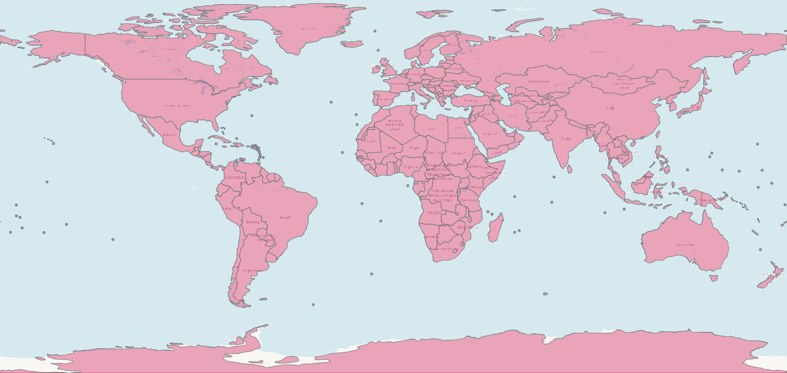

# Countries with tiny shapefile

A simplified world shapefile (EPSG:4326) derived from Natural Earth `ne_110m_admin_0_countries`, modified  to improve support for visualizing tiny sovereign nations and territories relevant to mosquito-borne diseases like **malaria** and **yellow fever**.

## Purpose
- Lightweight for web visualizations (CDC, Travel Medicine dashboards)
- Includes **tiny countries and islands** often omitted (e.g., Nauru, Tuvalu, Monaco, Liechtenstein, Caribbean islands, Oceania islands)
- Not suitable for land use or border accuracy

## Files
### Shapefile
- `countries_with_tiny_vkp.shp`  
- `countries_with_tiny_vkp.shx`  
- `countries_with_tiny_vkp.dbf`  
- `countries_with_tiny_vkp.prj`  
- `countries_with_tiny_vkp.cpg`

### Other files
- `countries_with_tiny_vkp.xlsx` – shapefile summary and attribute dictionary

## Version

- **Current version:** `1.1.2`
- **Timestamp:** `2024-03-23 23:30`

---

## Shapefile Summary

| Property             | Value |
|----------------------|-------|
| Number of Features   | 250 |
| Geometry Types       | MultiPolygon, Polygon |
| Bounding Box         | `(-180.0, -90.0)` to `(180.00000000000006, 83.64513000000001)` |
| Coordinate Reference System | EPSG:4326 |
| Attribute Columns    | SOV_A3, ADM0_A3, Country_Ta, Country, BRK_A3, ISO_A2, CONTINENT, SUBREGION, VKP_A3, geometry |

## Attribute Columns

| Column        | Explanation |
|---------------|-------------|
| `SOV_A3`      | 3-letter code representing the sovereign country |
| `ADM0_A3`     | Administrative 3-letter code (often for boundaries) |
| `Country_Ta`  | Country name in an alternate language or local variant |
| `Country`     | Country name in English |
| `BRK_A3`      | Alternate or broken 3-letter country code |
| `ISO_A2`      | 2-letter ISO country code |
| `CONTINENT`   | Name of the continent |
| `SUBREGION`   | Subregion within the continent |
| `VKP_A3`      | Alternate country code specific to this dataset |
| `geometry`    | Geometrical representation of boundaries (Polygon or MultiPolygon) |

---

## License
- [CC0 1.0 Universal](LICENSE)

## Source Attribution
- Based on: [Natural Earth](https://www.naturalearthdata.com/)
- Original dataset: `ne_110m_admin_0_countries`

---

## Feedback & Contributions

If you find any mistakes, missing countries, misrepresented microstates, or have suggestions to improve this file for public health use. Please open an [issue](https://github.com/YOUR_USERNAME/countries-with-tiny-vkp/issues) in this repository.
